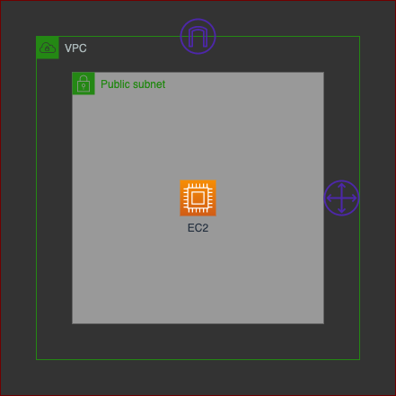

# **EXAMPLE PULUMI FOR AWS**
### **Design**

### **How To**
1. Create infrastructure with pulumi 
```
pulumi up
```
2. Set region (change region base on your need)
```
pulumi config set aws:region ap-southeast-3
```

