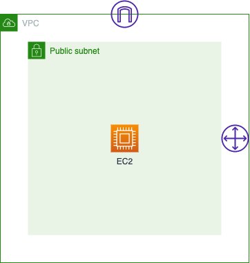

# **EXAMPLE PULUMI(TYPESCRIPT) FOR AWS**
### **Infrastructure Design**

> Docker will be installed in EC2, and will pull nginx image (userdata AWS)
### **Requirement**
1. [AWS CLI installed](https://docs.aws.amazon.com/cli/latest/userguide/getting-started-install.html)
2. [Configure AWS CLI](https://docs.aws.amazon.com/cli/latest/userguide/cli-configure-quickstart.html#cli-configure-quickstart-config)
3. [Pulumi installed](https://www.pulumi.com/docs/get-started/install/)
4. [Pulumi logged in](https://www.pulumi.com/docs/reference/cli/pulumi_login/)
### **How To**
1. Set region (change region base on your need)
```
pulumi config set aws:region ap-southeast-3
```
2. Install package needed
```
npm install
```
3. Generate keypair
```
ssh-keygen -f keypair
```
4. Create infrastructure with pulumi 
```
pulumi up
```
5. Make sure instance already in Ok status
6. Test your web application
```
curl $(pulumi stack output outputInstancePublicIp)
```
### **Cleaning Up**
1. Destroy infrastructure
```
pulumi destroy
```
